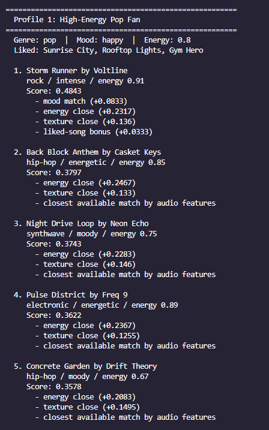
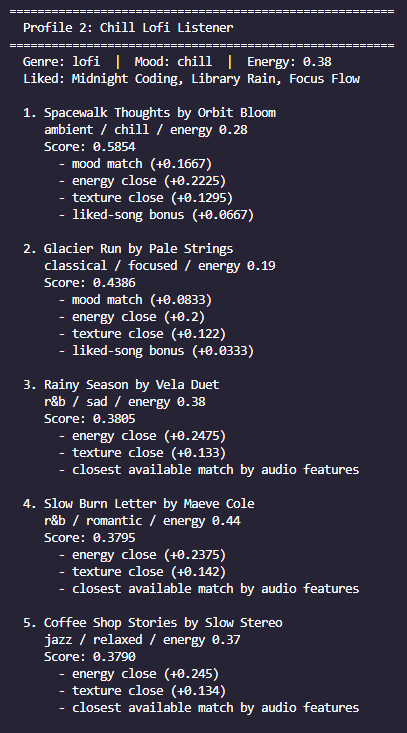
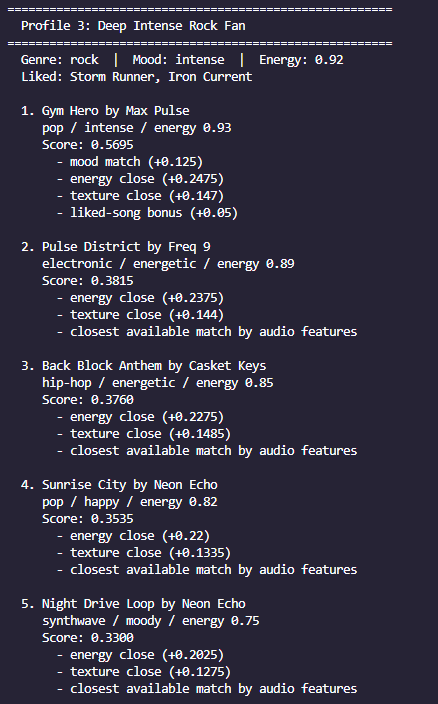
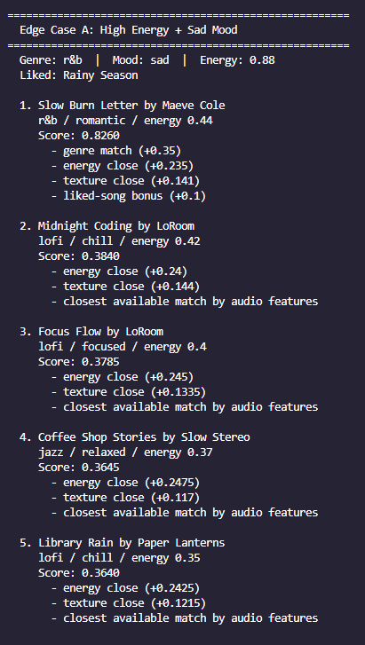
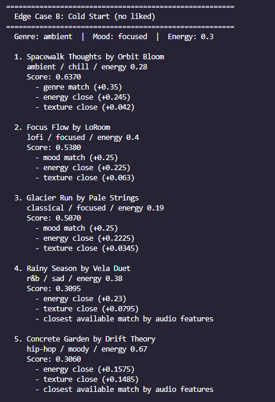
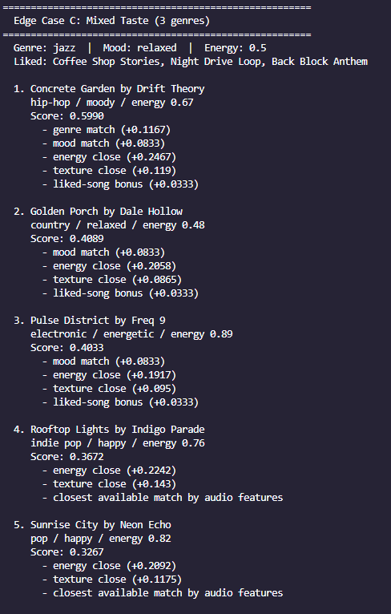
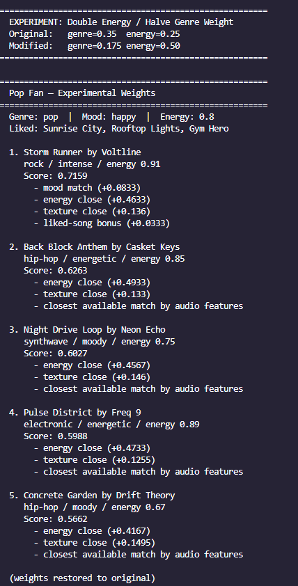

# 🎵 Music Recommender Simulation

## Project Summary

In this project you will build and explain a small music recommender system.

Your goal is to:

- Represent songs and a user "taste profile" as data
- Design a scoring rule that turns that data into recommendations
- Evaluate what your system gets right and wrong
- Reflect on how this mirrors real world AI recommenders

DESCP:
First we build a quick profile of the user from the songs they already like. That profile lets us rank new songs against their favorites and find music that aligns with their vibe, even if it’s in a completely different genre.

---

## How The System Works

- We look at the songs a user already likes and build a quick profile from them
- That profile is the average feel of their liked songs: average energy, average acousticness, most common genre, most common mood
- We then score every other song in the catalog by how close it is to that profile
- Songs that match the genre or mood of the liked songs score higher
- Songs that feel similar in energy and texture also score higher, even if the genre is different
- We rank all the scores and return the top matches

### Song Features

 genre - style of the track (lofi, pop, rock, jazz, ambient, synthwave, indie pop, hip-hop, r&b, classical, metal, country, electronic)
 mood - emotional feel (chill, happy, intense, focused, relaxed, moody, energetic, sad, angry, nostalgic, romantic)
 energy - how driving or mellow the song is (0 to 1)
 acousticness - how organic vs produced the sound is (0 to 1)
 valence - how bright or dark the song feels (0 to 1)

### UserProfile (built from liked songs + dictionary base)

- genre and mood from the user dictionary as a starting point
- average energy derived from liked songs
- average acousticness derived from liked songs
- most common genre and mood across liked songs (soft frequency score, not hard match)
- the original liked songs list used to apply a small bonus to close matches

### Algorithm Recipe

Step 1 - Build the centroid from liked songs (average numerics, most common categoricals)

Step 2 - For each song not already liked, compute a score:

- genre score  = 0.35 x how often that genre appears in liked songs
- mood score   = 0.25 x how often that mood appears in liked songs
- energy score = 0.25 x (1 - distance between song energy and liked-song average)
- texture score= 0.15 x (1 - distance between song acousticness and liked-song average)
- liked bonus  = +0.10 x similarity boost when genre or mood matches a liked song

Step 3 - Add up all parts into a final score between 0.0 and 1.0

Step 4 - Sort all scores highest to lowest and return the top 5

### Potential Biases to Watch For

- Genre gets the highest weight (0.35), so a great song in the wrong genre can get buried even if the energy and mood are a perfect match
- If all liked songs share the same genre, the system will strongly favor that genre and may miss good matches in similar styles like indie pop vs pop
- The catalog only has 20 songs, so the top 5 results include songs that may not actually be a good fit — the system just picks the least-bad options available
- Mood labels are subjective and assigned manually, so two people might describe the same song differently, which throws off the matching
- The liked-songs bonus slightly double-counts genre and mood, which can amplify the genre bias further

---

## Getting Started

### Project Structure

```
music-recommender/
├── data/
│   └── songs.csv          # song catalog (20 songs)
├── src/
│   ├── main.py            # entry point
│   └── recommender.py     # Song, UserProfile, Recommender classes
├── tests/
│   └── test_recommender.py
├── model_card.md
├── requirements.txt
└── README.md
```

### Setup

1. Create a virtual environment (optional but recommended):

   ```bash
   python -m venv .venv
   source .venv/bin/activate      # Mac or Linux
   .venv\Scripts\activate         # Windows

2. Install dependencies

```bash
pip install -r requirements.txt
```

3. Run the app:

```bash
python -m src.main
```

### Running Tests

Run the starter tests with:

```bash
pytest
```

You can add more tests in `tests/test_recommender.py`.

---

## Experiments You Tried







**Weight shift — double energy, halve genre**

Changed genre weight from 0.35 to 0.175 and energy weight from 0.25 to 0.50, then re-ran the High-Energy Pop Fan profile. The ranking order did not change at all. The same five songs appeared in the same positions with higher absolute scores but identical relative order. This revealed that energy was already the dominant signal for that profile even before the experiment — because all three liked pop songs were already in the catalog and excluded from results, the genre weight had nothing to match against. The signal that looked weaker was actually running the show.

**Adversarial profiles**

Three edge-case profiles were tested to stress-test the scoring logic:
- High energy (0.88) + sad mood: the system recommended a soft r&b song (Slow Burn Letter) because genre weight (0.35) dominated over the energy mismatch. A user who wants something loud and dark got something quiet and melancholy.
- Cold start (no liked songs): the fallback to explicit genre/mood fields worked — the system still returned reasonable ambient/focused results.
- Mixed taste (three different genres liked): the centroid spread out and energy proximity became the main tiebreaker, producing results that were sonically similar but stylistically scattered.

---

## Limitations and Risks

- Genre weight (0.35) is too high — a song in the wrong genre gets a large automatic penalty even if its energy, mood, and texture are a perfect match. A pop fan whose liked songs are all already in the catalog gets zero pop recommendations because those songs are excluded, making the genre weight irrelevant for that profile.
- The catalog is too small (20 songs) to provide real variety. With only 1–2 songs per genre, the system frequently returns songs that are the "least-bad option" rather than a genuine match. Adding more songs per genre would matter more than any weight adjustment.
- Mood labels are manually assigned and subjective — "intense" appears on both a rock anthem and a pop workout track, so the system treats them as equivalent even though they feel completely different as listening experiences.

---

## Reflection

Read and complete `model_card.md`:

[**Model Card**](model_card.md)

Write 1 to 2 paragraphs here about what you learned:

- about how recommenders turn data into predictions
- about where bias or unfairness could show up in systems like this

Through this assignment I learned how you need to make your algorithms very dynamic and be sure to have factors from multiple sectors to account for human nuance. Even if I have a correct algo, it needs to accurately reflect human nature. We are attracted to certain features and not only exact genres or numbers, and we need to be able to understand this first to write something that reflects that.
AI tools helped do a lot of the syntax and coding, but their recommendations for the algo were far too granular and had no vision of how people's personal tastes could be reflected in music, and this made equations that were too stiff.
Pattern recognition can feel like the program is reading your mind, but really it's just fine-tuned guesses that are padded with information.
If I extended this project, I would want to have a recommended radio list based on a specific song, like how Spotify has implemented. I think that is a better way to do recommendations.

---
