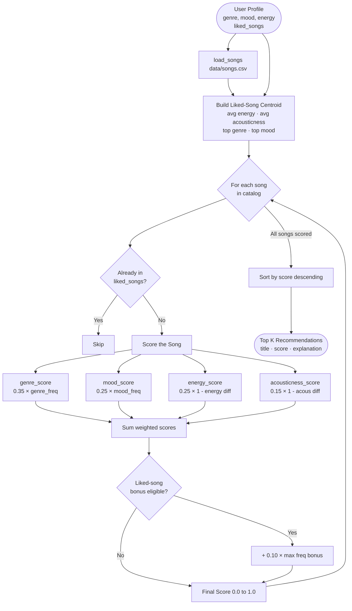

# Music Recommender — Data Flow

## Input → Process → Output



## Single Song Trace

How one song moves from CSV to ranked output:

```
"Night Drive Loop" enters the loop
  → NOT in liked_songs → proceed to scoring
  → genre: synthwave  — 0/3 liked songs match → genre_freq = 0.00
  → mood:  moody      — 0/3 liked songs match → mood_freq  = 0.00
  → energy: 0.75      — liked avg 0.84        → 1 - |0.75 - 0.84| = 0.91
  → acousticness: 0.22 — liked avg 0.19       → 1 - |0.22 - 0.19| = 0.97
  → score = (0.00 × 0.35) + (0.00 × 0.25) + (0.91 × 0.25) + (0.97 × 0.15)
          = 0.00 + 0.00 + 0.2275 + 0.1455
          = 0.3730
  → no liked bonus (genre_freq = 0, mood_freq = 0)
  → final score: 0.3743 → ranked #3
```

## Weights Reference

| Feature      | Weight | Signal                              |
|--------------|--------|-------------------------------------|
| genre        | 0.35   | Style match from liked songs        |
| mood         | 0.25   | Emotional intent match              |
| energy       | 0.25   | Proximity to liked-song avg energy  |
| acousticness | 0.15   | Texture proximity                   |
| liked bonus  | +0.10  | Bonus when genre or mood freq > 0   |